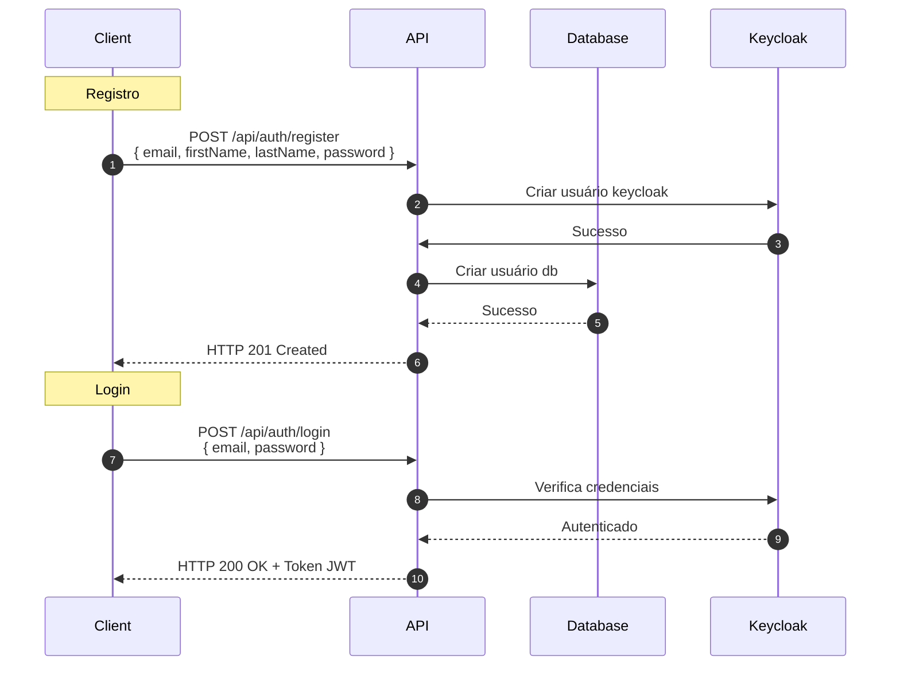
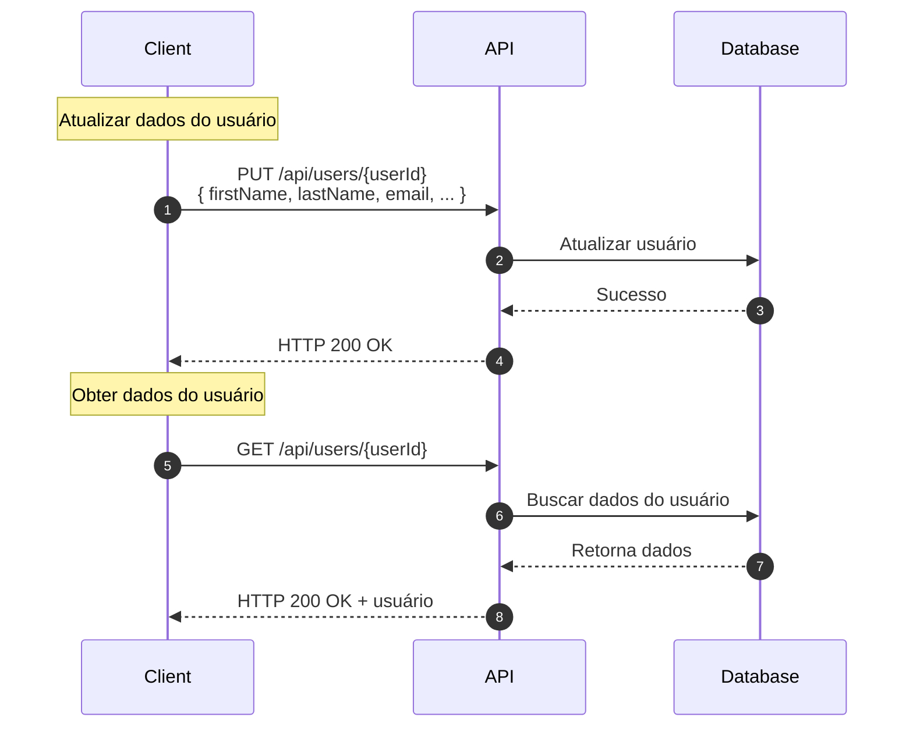
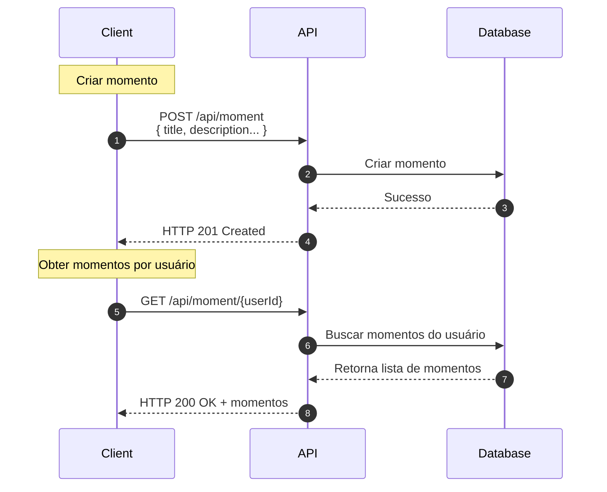
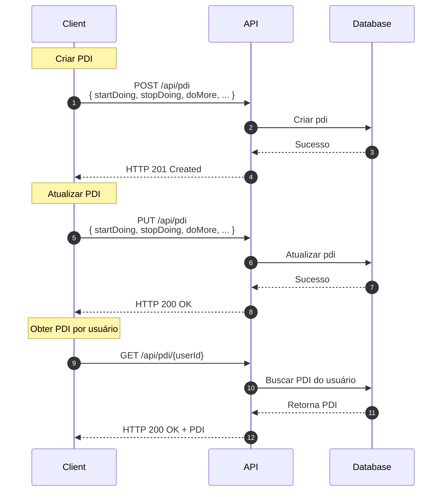

<h3 align="center">
   
</h3>

<h1 align="center">👨‍💻 GDP Flow</h1>

<h3 align="center">
  Gestão de carreira simplificada, conquistas visíveis.
</h3>

<h4 align="center">
   Status: Concluído 🚀
</h4>

---

## 📋 Índice
- [Sobre](#-sobre)
- [Tecnologias utilizadas](#%EF%B8%8F-tecnologias-utilizadas)
- [Funcionalidades](#%EF%B8%8F-funcionalidades)
- [Estrutura do Banco de Dados](#%EF%B8%8F-estrutura-do-banco-de-dados)
- [Diagrama da aplicação](#-diagrama-da-aplicação)
- [Colaboradores](#-colaboradores)

---

## 💻 Sobre
GDP Flow é um projeto desenvolvido ao longo de 1 final de semana durante o hackathon da [ContCode Community](https://www.linkedin.com/company/contcode-community/posts/?feedView=all)
a aplicação é uma plataforma para gestão de carreira, projetada para integrar o Ciclo de Gestão por Desempenho (GDP), o Plano de Desenvolvimento Individual (PDI) e o plano de carreira dos colaboradores em uma única solução, ajudando empresas a centralizar e organizar o desenvolvimento de seus talentos, enquanto capacita os profissionais a acompanharem sua evolução e alcançarem seus objetivos de carreira.

Foi desenvolvido com o objetivo de:
- **Dar visibilidade às conquistas:** Garanta que projetos importantes e ações de impacto sejam reconhecidos pelos gestores.
- **Facilitar a gestão de performance:** Acompanhe ciclos de desempenho de forma estruturada.
- **Personalizar o desenvolvimento individual:** Planeje o PDI com ações claras e específicas.
- **Promover transparência e acessibilidade:** Colaboradores e gestores têm acesso a informações essenciais sobre o crescimento e as conquistas.

---

## 🛠️ Tecnologias utilizadas
  - **.NET 8**
  - **Entity Framework Core**
  - **Keycloak**
  - **PostgreSQL**
  - **FluentResults**
  - **Swagger**

---

### ⚙️ Funcionalidades
**Cadastro e Login**
  - Integração com **Keycloak** para autenticação segura.

**Painel de Usuário**
  - Visualize informações do perfil, histórico de ciclos GDP.
  - Crie e gerencie o Plano de Desenvolvimento Individual (PDI) interativo.
  - Crie e gerencie a sua linha do tempo com os momentos mais importantes do seu ano.

---

# 🗃️ Estrutura do Banco de Dados
O banco de dados foi projetado utilizando PostgreSQL, com tabelas e relacionamentos otimizados para suportar as funcionalidades da plataforma, incluindo:
  - **Usuários:** Informações pessoais e perfis de acesso.
  - **Habilidades:** Relacionamento entre usuários e suas habilidades técnicas.
  - **Momentos:** Registro de marcos importantes do ciclo GDP.
  - **PDI:** Dados dinâmicos para o plano de desenvolvimento individual.

<h1 align="#-diagrama-da-aplicação">
   
</h1>

---

# 🧩 Diagrama da aplicação:

## Cadastro e login:

## Gerenciamento de Usuários:

## Criar linha do tempo com momentos:

## Criar e gerenciar PDI:

---

## 🔗 Links Úteis
- [Figma](https://www.figma.com/design/t85gM3lPYiil6qGyg3VE3Y/GDP-Flow?node-id=0-1&t=wRVPSYK6sbv3Dvp7-1)

---

## 🤝 Colaboradores

Este projeto foi desenvolvido com a colaboração de:

<table>
  <tr>
    <td align="center"><a href="https://www.linkedin.com/in/thau%C3%A3-engelmann-6aaa04219/"> <b>Thauã Engelmann</b></a> </td>
   <td align="center"><a href="https://www.linkedin.com/in/rafaelmjardim/"> <b>Rafael Jardim</b></a> </td>
 <td align="center"><a href="https://www.linkedin.com/in/paulo-ricardo-magalhaes/"> <b>Paulo Ricardo</b></a> </td>
     <td align="center"><a href="https://www.linkedin.com/in/jorge--lima/"> <b>Jorge Lima</b></a> </td>
  </tr>
</table>

 

